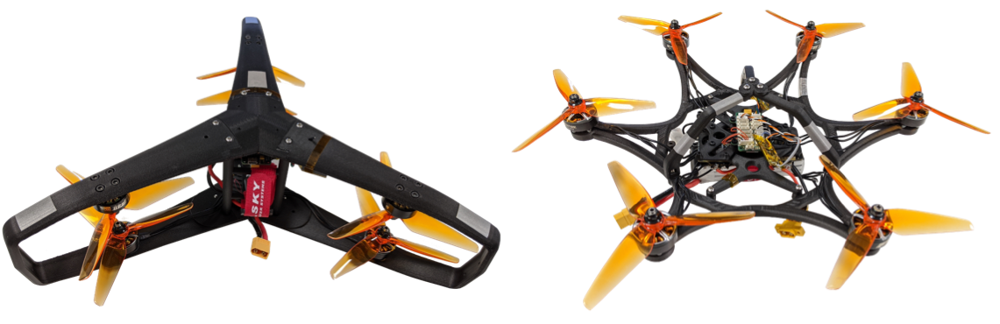

<!--     pandoc -f markdown -t html index.md > index.html   -->

## Interested in these vehicles ?

<!--  -->


### You can check-out our paper :

A Novel Robust Hexarotor Capable of Static Hovering in Presence of Propeller Failure
[PDF](https://hal.archives-ouvertes.fr/hal-02970614)


### and download the STL files and build your own !

[Star-Shaped](https://github.com/mrtbrnz/RoBust/tree/main/hardware/STL_files/star-shaped) and [Y-Shaped](https://github.com/mrtbrnz/RoBust/tree/main/hardware/STL_files/y-shaped)

<!-- 
```markdown
Syntax highlighted code block

# Header 1
## Header 2
### Header 3

- Bulleted
- List

1. Numbered
2. List

**Bold** and _Italic_ and `Code` text

[Link](url) and 
``` -->
